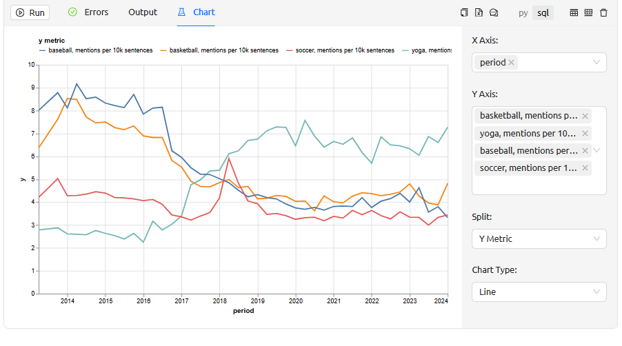
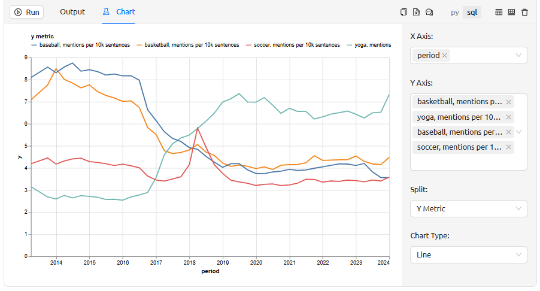
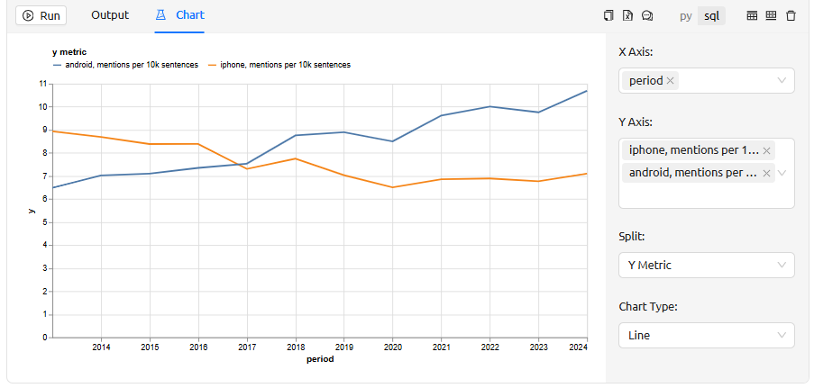
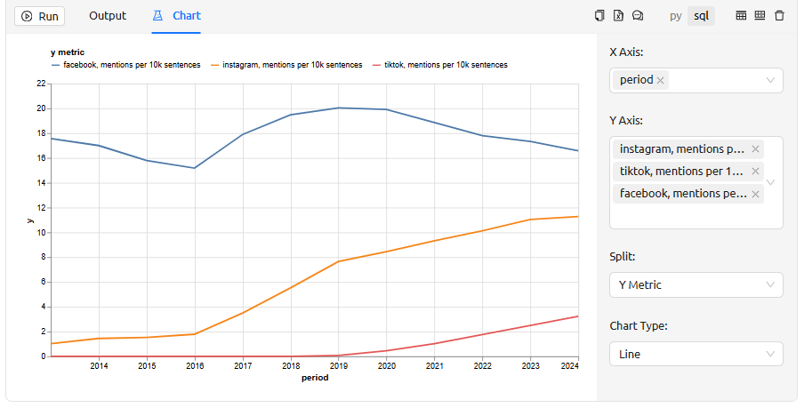
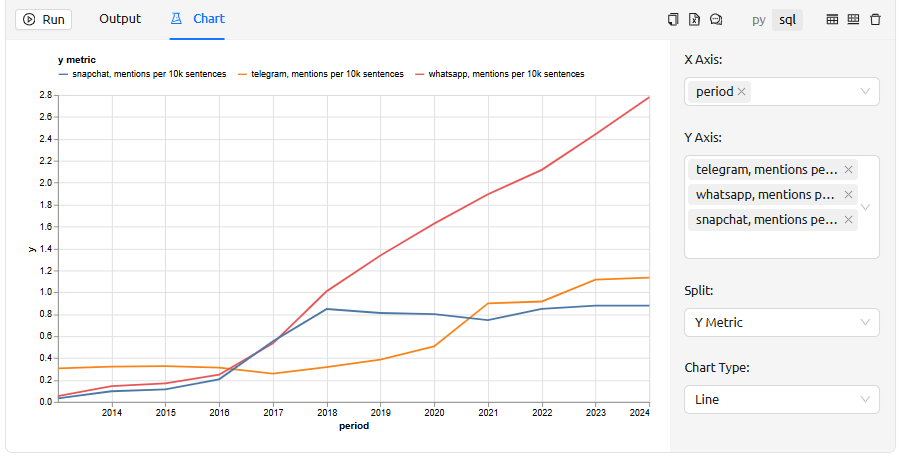
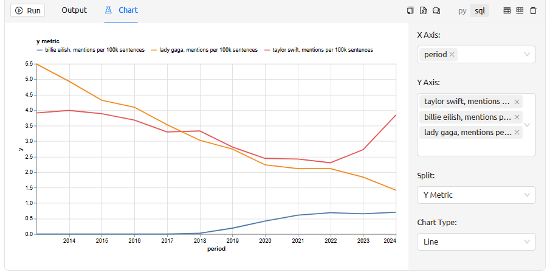

= Analysing texts on the example of FineWeb dataset
include::partial$dict.adoc[]

This example demonstrates how large text corpora can be analysed using {Tengri}.

We will use the dataset https://huggingface.co/datasets/HuggingFaceFW/fineweb[FineWeb, window=_blank] for the analysis. It consists of over *18.5 trillion* tokens of cleaned and deduplicated English-language texts from the web from https://en.wikipedia.org/wiki/Common_Crawl[CommonCrawl, window=_blank]. Essentially this dataset consists of casts of the entire English-speaking internet at a specific point in time (from 2013 to 2025). It is used mainly for training {LLM}.

[id=source_data_upload]
== Downloading raw data

The *FineWeb* dataset https://huggingface.co/datasets/HuggingFaceFW/fineweb#how-to-download-and-use-%F0%9F%8D%B7-fineweb[provides, window=_blank] different options for loading data. There are the following options:

. Upload the entire dataset -- about *108{nbsp}TB*.
. Download specific dumps -- casts for a specific time period. Each dump takes up about *500{nbsp}GB*.
. Load samples of a certain size -- randomly selected subsets of data taken across all dumps. +
Possible sample volume:
** `10BT` -- 10 billion gpt2 tokens (*27.6{nbsp}GB*)
** `100BT` -- 100 billion gpt2 tokens (*277.4{nbsp}GB*)
** `350BT` -- 350 billion gpt2 tokens (*388{nbsp}GB*)

For this demonstration, we chose the third option -- bootstrapping on random samples taken across all time periods, since our analysis will rely on possible differences in performance across periods.

Let's start loading. First of all, in the cell of the type {Python} import the modules necessary for work:

[source,Python]
----
import tngri
import os
import datetime
from pathlib import Path
from huggingface_hub import snapshot_download
----

[source,output,role=output]
----
done at 2025-12-20 12:13:26.365034
----

Now let's describe a function at {Python} to download a sample of the specified size and load it into the specified table. To load the table we will use the function `xref:ROOT:functions/tengri_functions.adoc#sql[tngri.sql]`.

[source,Python]
----
def fineweb_download(sample_size, table_name):
    my_dir = f'fineweb_{sample_size}'
    
    <1>
    if os.path.exists(my_dir) and os.path.isdir(my_dir):
        shutil.rmtree(my_dir)
    
    <2>
    snapshot_download("HuggingFaceFW/fineweb",
                    repo_type="dataset",
                    local_dir=my_dir,
                    allow_patterns=f"sample/{sample_size}/*")
    
    <3>
    files_total = len([x for x in Path(my_dir).rglob('*') \
        if os.path.isfile(x) and str(x).endswith('.parquet')])
    
    created = False
    file_count = 0
    start = datetime.datetime.now()
    
    <4>
    for subdir, dirs, files in os.walk(my_dir):
        for file in files:
            filepath = os.path.join(subdir, file)

            if not filepath.endswith('.parquet'):
                continue

            file_count += 1
            print(f'File {file_count}/{files_total}: {filepath}')
            print('Size:', size(os.path.getsize(filepath)))

            <5>
            uploaded_file = tngri.upload_file(filepath)

            <6>
            if not created:
                tngri.sql(f'create or replace table {table_name} as \
                            select * from read_parquet("{uploaded_file}")')
                created = True
            else:
                tngri.sql(f'insert into {table_name} select * \
                            from read_parquet("{uploaded_file}")')
            
            <7>
            count = tngri.sql(f'select count(*) from {table_name}')
            print(f'Created table row count: {count[0,0]}')
            
            print(f'Time from start: {str(datetime.datetime.now() - start)}')
    print(f'Uploaded in {str(datetime.datetime.now() - start)}')
----

[source,output,role=output]
----
Done in 4 sec.
----

<1> Clean the temporary folder (so that the data is filled from scratch at each startup)
<2> Start the download
<3> Count how many parquet files have been downloaded
<4> Go through all downloaded files and load the data into the table
<5> Upload the file to {Tengri} using the `xref:ROOT:functions/tengri_functions.adoc#upload_file[tngri.upload_file]` function
<6> On the first pass, create a table, on the rest, just add data; use the `xref:ROOT:functions/tengri_functions.adoc#sql[tngri.sql]` function
<7> Display the intermediate length of the table being filled

Let's start by loading the smallest sample -- `10BT`:

[source,Python]
----
fineweb_download('10BT', 'demo.fineweb_sample_10BT')
----

._See output_
[%collapsible]
====
[source,output,role=output]
----
Done in 22 min.

Fetching 15 files:   0%|          | 0/15 [00:00<?, ?it/s]
Fetching 15 files:   7%|▋         | 1/15 [07:08<1:39:57, 428.36s/it]
Fetching 15 files:  20%|██        | 3/15 [09:03<30:44, 153.72s/it]
Fetching 15 files:  53%|█████▎    | 8/15 [09:17<05:09, 44.17s/it]
Fetching 15 files:  60%|██████    | 9/15 [10:41<05:06, 51.08s/it]
Fetching 15 files:  67%|██████▋   | 10/15 [11:00<03:43, 44.63s/it]
Fetching 15 files:  73%|███████▎  | 11/15 [12:23<03:32, 53.06s/it]
Fetching 15 files:  80%|████████  | 12/15 [12:43<02:15, 45.16s/it]
Fetching 15 files:  93%|█████████▎| 14/15 [12:45<00:27, 27.35s/it]
Fetching 15 files: 100%|██████████| 15/15 [12:45<00:00, 51.04s/it]

File 1/15: fineweb_10BT/sample/10BT/011_00000.parquet
Size: 1G
Created table row count: 1033752
Time from start: 0:00:29.632723
File 2/15: fineweb_10BT/sample/10BT/014_00000.parquet
Size: 548M
Created table row count: 1315416
Time from start: 0:00:45.758067
File 3/15: fineweb_10BT/sample/10BT/002_00000.parquet
Size: 2G
Created table row count: 2362045
Time from start: 0:01:17.201461
File 4/15: fineweb_10BT/sample/10BT/000_00000.parquet
Size: 1G
Created table row count: 3410626
Time from start: 0:01:48.977265
File 5/15: fineweb_10BT/sample/10BT/009_00000.parquet
Size: 2G
Created table row count: 4449266
Time from start: 0:02:20.716597
File 6/15: fineweb_10BT/sample/10BT/003_00000.parquet
Size: 1G
Created table row count: 5495871
Time from start: 0:02:52.690474
File 7/15: fineweb_10BT/sample/10BT/012_00000.parquet
Size: 2G
Created table row count: 6530586
Time from start: 0:03:25.198067
File 8/15: fineweb_10BT/sample/10BT/008_00000.parquet
Size: 1G
Created table row count: 7565226
Time from start: 0:03:56.557413
File 9/15: fineweb_10BT/sample/10BT/007_00000.parquet
Size: 2G
Created table row count: 8608873
Time from start: 0:04:30.311380
File 10/15: fineweb_10BT/sample/10BT/013_00000.parquet
Size: 2G
Created table row count: 9655610
Time from start: 0:05:04.350260
File 11/15: fineweb_10BT/sample/10BT/005_00000.parquet
Size: 1G
Created table row count: 10702268
Time from start: 0:05:38.026093
File 12/15: fineweb_10BT/sample/10BT/006_00000.parquet
Size: 1G
Created table row count: 11745931
Time from start: 0:06:11.046026
File 13/15: fineweb_10BT/sample/10BT/001_00000.parquet
Size: 1G
Created table row count: 12792546
Time from start: 0:06:43.937408
File 14/15: fineweb_10BT/sample/10BT/004_00000.parquet
Size: 1G
Created table row count: 13833162
Time from start: 0:07:17.067437
File 15/15: fineweb_10BT/sample/10BT/010_00000.parquet
Size: 2G
Created table row count: 14868862
Time from start: 0:07:50.150215
Uploaded in 0:07:50.150305
----
====

In 22 minutes we loaded the smallest size sample and got a table of size *14.8 million* rows. Let's display a few rows of this table to check the loaded data:

[source,sql]
----
SELECT * FROM demo.fineweb_sample_10BT
    LIMIT 5
----

[source,output,role=output]
----
+--------------------------------------------------------+-------------------------------------------------+-----------------+---------------------------------------------------------------------------------------------------------+----------------------+--------------------------------------------------------------------------------------------------------------------------------+----------+----------------+-------------+
| text                                                   | id                                              | dump            | url                                                                                                     | date                 | file_path                                                                                                                      | language | language_score | token_count |
+--------------------------------------------------------+-------------------------------------------------+-----------------+---------------------------------------------------------------------------------------------------------+----------------------+--------------------------------------------------------------------------------------------------------------------------------+----------+----------------+-------------+
| Thank you guys for the responses! Close combat is  ... | <urn:uuid:0d2b3414-c50e-47ec-a145-1ecd22a348b8> | CC-MAIN-2020-24 | http://www.40konline.com/index.php?topic=223837.0;prev_next=prev                                        | 2020-05-25T11:49:14Z | s3://commoncrawl/crawl-data/CC-MAIN-2020-24/segments/1590347388427.15/warc/CC-MAIN-20200525095005-20200525125005-00534.warc.gz | en       | 0,9705834389   | 320         |
+--------------------------------------------------------+-------------------------------------------------+-----------------+---------------------------------------------------------------------------------------------------------+----------------------+--------------------------------------------------------------------------------------------------------------------------------+----------+----------------+-------------+
| MEDAL OF HONOR RECIPIENT THOMAS J. KINSMAN PASSES  ... | <urn:uuid:a0f3a248-df51-4269-84d1-d26d8730155c> | CC-MAIN-2020-24 | https://themedalofhonor.com/press_releases/medal-of-honor-recipient-thomas-j-kinsman-passes-away-at-72/ | 2020-05-25T12:07:08Z | s3://commoncrawl/crawl-data/CC-MAIN-2020-24/segments/1590347388427.15/warc/CC-MAIN-20200525095005-20200525125005-00534.warc.gz | en       | 0,9769160748   | 470         |
+--------------------------------------------------------+-------------------------------------------------+-----------------+---------------------------------------------------------------------------------------------------------+----------------------+--------------------------------------------------------------------------------------------------------------------------------+----------+----------------+-------------+
| These Buckwheat and Chocolate Bliss Balls are an e ... | <urn:uuid:a90e6084-06a0-4363-9018-58514f5df315> | CC-MAIN-2020-24 | https://www.dhmaya.com/buckwheat-and-chocolate-bliss-balls/                                             | 2020-05-25T11:51:30Z | s3://commoncrawl/crawl-data/CC-MAIN-2020-24/segments/1590347388427.15/warc/CC-MAIN-20200525095005-20200525125005-00534.warc.gz | en       | 0,7672950029   | 974         |
+--------------------------------------------------------+-------------------------------------------------+-----------------+---------------------------------------------------------------------------------------------------------+----------------------+--------------------------------------------------------------------------------------------------------------------------------+----------+----------------+-------------+
| PANAMA CITY BEACH, Fla. (WJHG/WECP) - A three-car  ... | <urn:uuid:3fa75684-1dda-406a-a126-9cbad9dab78c> | CC-MAIN-2020-24 | https://www.wjhg.com/content/news/Three-508574761.html                                                  | 2020-05-25T09:54:25Z | s3://commoncrawl/crawl-data/CC-MAIN-2020-24/segments/1590347388427.15/warc/CC-MAIN-20200525095005-20200525125005-00534.warc.gz | en       | 0,9612885118   | 99          |
+--------------------------------------------------------+-------------------------------------------------+-----------------+---------------------------------------------------------------------------------------------------------+----------------------+--------------------------------------------------------------------------------------------------------------------------------+----------+----------------+-------------+
| New ways to say goodbye How do you pay tribute to  ... | <urn:uuid:0645fbdd-e306-4dec-b308-fc35202c8959> | CC-MAIN-2020-24 | http://www.petcremationservices.co.uk/new-ways-to-say-goodbye/                                          | 2020-05-27T08:04:27Z | s3://commoncrawl/crawl-data/CC-MAIN-2020-24/segments/1590347392142.20/warc/CC-MAIN-20200527075559-20200527105559-00134.warc.gz | en       | 0,9408096671   | 251         |
+--------------------------------------------------------+-------------------------------------------------+-----------------+---------------------------------------------------------------------------------------------------------+----------------------+--------------------------------------------------------------------------------------------------------------------------------+----------+----------------+-------------+
----

Now we can see all the columns that are in the source data. Their detailed descriptions can be seen https://huggingface.co/datasets/HuggingFaceFW/fineweb#data-fields[here, window=_blank].

Since it didn't take very long to download the smallest sample, let's try to download a larger sample -- `100BT`.

[source,Python]
----
fineweb_download('100BT', 'demo.fineweb_sample_100BT')
----

._See output_
[%collapsible]
====
[source,output,role=output]
----
Done in 8 h. 32 min.

Fetching 150 files:   0%|          | 0/150 [00:00<?, ?it/s]
Fetching 150 files:   1%|          | 1/150 [07:23<18:21:06, 443.40s/it]
Fetching 150 files:   6%|▌         | 9/150 [10:39<2:16:43, 58.18s/it]
Fetching 150 files:   7%|▋         | 10/150 [10:54<2:01:29, 52.07s/it]
Fetching 150 files:   7%|▋         | 11/150 [14:01<2:53:22, 74.84s/it]
Fetching 150 files:   8%|▊         | 12/150 [14:30<2:31:35, 65.91s/it]
Fetching 150 files:  10%|█         | 15/150 [15:09<1:34:21, 41.94s/it]
Fetching 150 files:  12%|█▏        | 18/150 [15:25<1:00:30, 27.50s/it]
Fetching 150 files:  13%|█▎        | 19/150 [19:38<2:17:42, 63.07s/it]
Fetching 150 files:  13%|█▎        | 20/150 [21:06<2:26:45, 67.74s/it]
Fetching 150 files:  15%|█▍        | 22/150 [21:28<1:42:47, 48.18s/it]
Fetching 150 files:  16%|█▌        | 24/150 [21:43<1:13:02, 34.79s/it]
Fetching 150 files:  17%|█▋        | 25/150 [22:27<1:16:02, 36.50s/it]
Fetching 150 files:  17%|█▋        | 26/150 [23:14<1:19:54, 38.67s/it]
Fetching 150 files:  18%|█▊        | 27/150 [24:50<1:46:51, 52.12s/it]
Fetching 150 files:  19%|█▊        | 28/150 [26:08<1:59:16, 58.66s/it]
Fetching 150 files:  19%|█▉        | 29/150 [27:47<2:19:51, 69.35s/it]
Fetching 150 files:  20%|██        | 30/150 [29:17<2:30:03, 75.03s/it]
Fetching 150 files:  22%|██▏       | 33/150 [29:58<1:21:44, 41.92s/it]
Fetching 150 files:  23%|██▎       | 35/150 [31:06<1:15:14, 39.25s/it]
Fetching 150 files:  24%|██▍       | 36/150 [31:27<1:07:39, 35.61s/it]
Fetching 150 files:  25%|██▍       | 37/150 [34:00<1:55:06, 61.12s/it]
Fetching 150 files:  26%|██▌       | 39/150 [35:24<1:39:33, 53.82s/it]
Fetching 150 files:  27%|██▋       | 40/150 [36:01<1:32:07, 50.25s/it]
Fetching 150 files:  28%|██▊       | 42/150 [36:07<58:08, 32.30s/it]
Fetching 150 files:  29%|██▊       | 43/150 [38:11<1:32:29, 51.86s/it]
Fetching 150 files:  30%|███       | 45/150 [40:15<1:37:26, 55.68s/it]
Fetching 150 files:  31%|███▏      | 47/150 [41:30<1:24:42, 49.35s/it]
Fetching 150 files:  32%|███▏      | 48/150 [43:07<1:40:08, 58.91s/it]
Fetching 150 files:  33%|███▎      | 50/150 [43:13<1:04:03, 38.43s/it]
Fetching 150 files:  34%|███▍      | 51/150 [44:13<1:10:53, 42.96s/it]
Fetching 150 files:  35%|███▍      | 52/150 [45:20<1:19:01, 48.39s/it]
Fetching 150 files:  35%|███▌      | 53/150 [46:34<1:28:38, 54.83s/it]
Fetching 150 files:  36%|███▌      | 54/150 [47:37<1:30:56, 56.84s/it]
Fetching 150 files:  37%|███▋      | 55/150 [48:01<1:15:55, 47.95s/it]
Fetching 150 files:  37%|███▋      | 56/150 [49:44<1:38:56, 63.15s/it]
Fetching 150 files:  39%|███▉      | 59/150 [51:34<1:14:05, 48.85s/it]
Fetching 150 files:  40%|████      | 60/150 [52:13<1:10:13, 46.81s/it]
Fetching 150 files:  41%|████      | 61/150 [53:26<1:18:17, 52.78s/it]
Fetching 150 files:  41%|████▏     | 62/150 [54:06<1:12:40, 49.55s/it]
Fetching 150 files:  42%|████▏     | 63/150 [54:33<1:03:22, 43.71s/it]
Fetching 150 files:  43%|████▎     | 64/150 [55:03<57:20, 40.01s/it]
Fetching 150 files:  43%|████▎     | 65/150 [55:07<42:23, 29.92s/it]
Fetching 150 files:  44%|████▍     | 66/150 [55:37<42:11, 30.14s/it]
Fetching 150 files:  45%|████▍     | 67/150 [58:17<1:33:23, 67.51s/it]
Fetching 150 files:  45%|████▌     | 68/150 [58:49<1:18:19, 57.31s/it]
Fetching 150 files:  46%|████▌     | 69/150 [59:22<1:07:25, 49.95s/it]
Fetching 150 files:  47%|████▋     | 70/150 [1:00:04<1:03:30, 47.63s/it]
Fetching 150 files:  47%|████▋     | 71/150 [1:01:11<1:10:25, 53.49s/it]
Fetching 150 files:  48%|████▊     | 72/150 [1:03:19<1:38:13, 75.56s/it]
Fetching 150 files:  50%|█████     | 75/150 [1:04:56<1:04:15, 51.40s/it]
Fetching 150 files:  51%|█████▏    | 77/150 [1:05:55<53:19, 43.82s/it]
Fetching 150 files:  52%|█████▏    | 78/150 [1:07:22<1:02:45, 52.30s/it]
Fetching 150 files:  53%|█████▎    | 80/150 [1:08:40<55:26, 47.53s/it]
Fetching 150 files:  55%|█████▍    | 82/150 [1:10:14<53:41, 47.38s/it]
Fetching 150 files:  55%|█████▌    | 83/150 [1:12:02<1:06:12, 59.29s/it]
Fetching 150 files:  57%|█████▋    | 85/150 [1:13:03<53:02, 48.96s/it]
Fetching 150 files:  57%|█████▋    | 86/150 [1:14:07<55:22, 51.92s/it]
Fetching 150 files:  58%|█████▊    | 87/150 [1:14:38<49:29, 47.14s/it]
Fetching 150 files:  59%|█████▊    | 88/150 [1:16:25<1:03:56, 61.89s/it]
Fetching 150 files:  61%|██████    | 91/150 [1:17:31<40:48, 41.51s/it]
Fetching 150 files:  61%|██████▏   | 92/150 [1:18:58<48:41, 50.37s/it]
Fetching 150 files:  62%|██████▏   | 93/150 [1:19:23<42:34, 44.81s/it]
Fetching 150 files:  63%|██████▎   | 94/150 [1:20:24<45:25, 48.66s/it]
Fetching 150 files:  63%|██████▎   | 95/150 [1:21:27<47:52, 52.22s/it]
Fetching 150 files:  65%|██████▍   | 97/150 [1:22:05<33:56, 38.42s/it]
Fetching 150 files:  65%|██████▌   | 98/150 [1:22:34<31:17, 36.11s/it]
Fetching 150 files:  66%|██████▌   | 99/150 [1:24:04<42:02, 49.46s/it]
Fetching 150 files:  67%|██████▋   | 100/150 [1:24:40<38:21, 46.04s/it]
Fetching 150 files:  67%|██████▋   | 101/150 [1:25:35<39:37, 48.52s/it]
Fetching 150 files:  68%|██████▊   | 102/150 [1:27:12<49:36, 62.00s/it]
Fetching 150 files:  69%|██████▊   | 103/150 [1:27:36<40:04, 51.16s/it]
Fetching 150 files:  69%|██████▉   | 104/150 [1:29:23<51:39, 67.38s/it]
Fetching 150 files:  71%|███████   | 106/150 [1:30:13<35:22, 48.24s/it]
Fetching 150 files:  71%|███████▏  | 107/150 [1:31:05<35:06, 48.98s/it]
Fetching 150 files:  72%|███████▏  | 108/150 [1:32:08<36:57, 52.80s/it]
Fetching 150 files:  73%|███████▎  | 110/150 [1:32:40<24:39, 36.98s/it]
Fetching 150 files:  74%|███████▍  | 111/150 [1:32:49<19:48, 30.47s/it]
Fetching 150 files:  75%|███████▍  | 112/150 [1:34:38<31:47, 50.21s/it]
Fetching 150 files:  76%|███████▌  | 114/150 [1:37:44<40:50, 68.07s/it]
Fetching 150 files:  77%|███████▋  | 116/150 [1:39:33<35:42, 63.00s/it]
Fetching 150 files:  79%|███████▉  | 119/150 [1:39:37<18:20, 35.50s/it]
Fetching 150 files:  80%|████████  | 120/150 [1:40:04<17:04, 34.15s/it]
Fetching 150 files:  81%|████████  | 121/150 [1:40:59<18:29, 38.25s/it]
Fetching 150 files:  81%|████████▏ | 122/150 [1:42:55<25:52, 55.45s/it]
Fetching 150 files:  82%|████████▏ | 123/150 [1:44:12<27:19, 60.71s/it]
Fetching 150 files:  83%|████████▎ | 125/150 [1:46:21<25:55, 62.24s/it]
Fetching 150 files:  84%|████████▍ | 126/150 [1:48:13<29:22, 73.42s/it]
Fetching 150 files:  87%|████████▋ | 130/150 [1:49:04<13:05, 39.26s/it]
Fetching 150 files:  88%|████████▊ | 132/150 [1:49:23<09:13, 30.76s/it]
Fetching 150 files:  89%|████████▊ | 133/150 [1:51:55<14:31, 51.28s/it]
Fetching 150 files:  90%|█████████ | 135/150 [1:51:56<08:40, 34.69s/it]
Fetching 150 files:  91%|█████████ | 136/150 [1:54:37<13:40, 58.63s/it]
Fetching 150 files: 100%|██████████| 150/150 [1:54:41<00:00, 12.47s/it]
Fetching 150 files: 100%|██████████| 150/150 [1:54:41<00:00, 45.87s/it]

File 1/150: fineweb_100BT/sample/100BT/010_00006.parquet
Size: 2G
Created table row count: 1043719
Time from start: 0:00:28.852910
File 2/150: fineweb_100BT/sample/100BT/006_00001.parquet
Size: 1G
Created table row count: 2094339
Time from start: 0:01:01.744534
File 3/150: fineweb_100BT/sample/100BT/011_00000.parquet
Size: 1G
Created table row count: 3133065
Time from start: 0:01:33.096181
File 4/150: fineweb_100BT/sample/100BT/009_00008.parquet
Size: 1G
Created table row count: 4176711
Time from start: 0:02:03.285131
File 5/150: fineweb_100BT/sample/100BT/001_00004.parquet
Size: 1G
Created table row count: 5228342
Time from start: 0:02:33.440667
File 6/150: fineweb_100BT/sample/100BT/014_00002.parquet
Size: 228M
Created table row count: 5346224
Time from start: 0:02:45.836067
File 7/150: fineweb_100BT/sample/100BT/010_00004.parquet
Size: 2G
Created table row count: 6387939
Time from start: 0:03:16.229568
File 8/150: fineweb_100BT/sample/100BT/008_00007.parquet
Size: 1G
Created table row count: 7430532
Time from start: 0:03:47.389115
File 9/150: fineweb_100BT/sample/100BT/002_00002.parquet
Size: 2G
Created table row count: 8484171
Time from start: 0:04:17.673468
File 10/150: fineweb_100BT/sample/100BT/005_00003.parquet
Size: 2G
Created table row count: 9532816
Time from start: 0:04:48.737682
File 11/150: fineweb_100BT/sample/100BT/008_00006.parquet
Size: 1G
Created table row count: 10573420
Time from start: 0:05:19.362057
File 12/150: fineweb_100BT/sample/100BT/004_00006.parquet
Size: 2G
Created table row count: 11623027
Time from start: 0:05:50.208816
File 13/150: fineweb_100BT/sample/100BT/006_00008.parquet
Size: 2G
Created table row count: 12674674
Time from start: 0:06:21.136123
File 14/150: fineweb_100BT/sample/100BT/014_00000.parquet
Size: 289M
Created table row count: 12824334
Time from start: 0:06:35.916579
File 15/150: fineweb_100BT/sample/100BT/002_00000.parquet
Size: 1G
Created table row count: 13876952
Time from start: 0:07:06.777706
File 16/150: fineweb_100BT/sample/100BT/000_00001.parquet
Size: 2G
Created table row count: 14933571
Time from start: 0:07:38.816585
File 17/150: fineweb_100BT/sample/100BT/008_00008.parquet
Size: 2G
Created table row count: 15976203
Time from start: 0:08:09.023863
File 18/150: fineweb_100BT/sample/100BT/010_00009.parquet
Size: 2G
Created table row count: 17016928
Time from start: 0:08:40.462770
File 19/150: fineweb_100BT/sample/100BT/014_00008.parquet
Size: 92M
Created table row count: 17065178
Time from start: 0:08:49.528764
File 20/150: fineweb_100BT/sample/100BT/011_00008.parquet
Size: 2G
Created table row count: 18107879
Time from start: 0:09:20.749646
File 21/150: fineweb_100BT/sample/100BT/005_00006.parquet
Size: 1G
Created table row count: 19157553
Time from start: 0:09:54.081489
File 22/150: fineweb_100BT/sample/100BT/009_00005.parquet
Size: 1G
Created table row count: 20203222
Time from start: 0:10:26.292212
File 23/150: fineweb_100BT/sample/100BT/000_00000.parquet
Size: 2G
Created table row count: 21261862
Time from start: 0:10:59.173029
File 24/150: fineweb_100BT/sample/100BT/003_00005.parquet
Size: 1G
Created table row count: 22311481
Time from start: 0:11:30.492799
File 25/150: fineweb_100BT/sample/100BT/012_00004.parquet
Size: 2G
Created table row count: 23355169
Time from start: 0:12:01.600806
File 26/150: fineweb_100BT/sample/100BT/003_00002.parquet
Size: 2G
Created table row count: 24407778
Time from start: 0:12:33.296834
File 27/150: fineweb_100BT/sample/100BT/001_00007.parquet
Size: 2G
Created table row count: 25459381
Time from start: 0:13:06.284683
File 28/150: fineweb_100BT/sample/100BT/010_00001.parquet
Size: 2G
Created table row count: 26503114
Time from start: 0:13:39.525053
File 29/150: fineweb_100BT/sample/100BT/005_00008.parquet
Size: 1G
Created table row count: 27551779
Time from start: 0:14:13.082079
File 30/150: fineweb_100BT/sample/100BT/004_00002.parquet
Size: 2G
Created table row count: 28599409
Time from start: 0:14:46.372963
File 31/150: fineweb_100BT/sample/100BT/011_00007.parquet
Size: 2G
Created table row count: 29639150
Time from start: 0:15:19.568540
File 32/150: fineweb_100BT/sample/100BT/009_00000.parquet
Size: 2G
Created table row count: 30681832
Time from start: 0:15:53.101321
File 33/150: fineweb_100BT/sample/100BT/006_00002.parquet
Size: 2G
Created table row count: 31733500
Time from start: 0:16:26.300927
File 34/150: fineweb_100BT/sample/100BT/006_00007.parquet
Size: 2G
Created table row count: 32782146
Time from start: 0:17:00.225888
File 35/150: fineweb_100BT/sample/100BT/012_00008.parquet
Size: 1G
Created table row count: 33828841
Time from start: 0:17:32.810276
File 36/150: fineweb_100BT/sample/100BT/002_00007.parquet
Size: 1G
Created table row count: 34877448
Time from start: 0:18:08.108476
File 37/150: fineweb_100BT/sample/100BT/005_00007.parquet
Size: 2G
Created table row count: 35930049
Time from start: 0:18:42.200643
File 38/150: fineweb_100BT/sample/100BT/003_00000.parquet
Size: 2G
Created table row count: 36981675
Time from start: 0:19:15.925095
File 39/150: fineweb_100BT/sample/100BT/000_00004.parquet
Size: 1G
Created table row count: 38036322
Time from start: 0:19:50.572792
File 40/150: fineweb_100BT/sample/100BT/007_00008.parquet
Size: 2G
Created table row count: 39083982
Time from start: 0:20:25.948724
File 41/150: fineweb_100BT/sample/100BT/001_00002.parquet
Size: 2G
Created table row count: 40136583
Time from start: 0:21:01.833808
File 42/150: fineweb_100BT/sample/100BT/001_00001.parquet
Size: 2G
Created table row count: 41190213
Time from start: 0:21:37.824188
File 43/150: fineweb_100BT/sample/100BT/010_00005.parquet
Size: 2G
Created table row count: 42232927
Time from start: 0:22:12.425037
File 44/150: fineweb_100BT/sample/100BT/013_00002.parquet
Size: 2G
Created table row count: 43286646
Time from start: 0:22:47.126034
File 45/150: fineweb_100BT/sample/100BT/014_00009.parquet
Size: 91M
Created table row count: 43334180
Time from start: 0:22:57.208541
File 46/150: fineweb_100BT/sample/100BT/006_00005.parquet
Size: 2G
Created table row count: 44383846
Time from start: 0:23:31.219982
File 47/150: fineweb_100BT/sample/100BT/007_00005.parquet
Size: 2G
Created table row count: 45431510
Time from start: 0:24:08.005149
File 48/150: fineweb_100BT/sample/100BT/006_00004.parquet
Size: 2G
Created table row count: 46481147
Time from start: 0:24:44.025810
File 49/150: fineweb_100BT/sample/100BT/014_00004.parquet
Size: 160M
Created table row count: 46563933
Time from start: 0:24:55.228824
File 50/150: fineweb_100BT/sample/100BT/009_00007.parquet
Size: 1G
Created table row count: 47606598
Time from start: 0:25:30.684821
File 51/150: fineweb_100BT/sample/100BT/012_00002.parquet
Size: 2G
Created table row count: 48647292
Time from start: 0:26:06.884349
File 52/150: fineweb_100BT/sample/100BT/007_00009.parquet
Size: 1G
Created table row count: 49692952
Time from start: 0:26:42.211974
File 53/150: fineweb_100BT/sample/100BT/011_00005.parquet
Size: 1G
Created table row count: 50733683
Time from start: 0:27:17.721789
File 54/150: fineweb_100BT/sample/100BT/008_00004.parquet
Size: 2G
Created table row count: 51774333
Time from start: 0:27:53.212798
File 55/150: fineweb_100BT/sample/100BT/002_00001.parquet
Size: 2G
Created table row count: 52824930
Time from start: 0:28:29.285450
File 56/150: fineweb_100BT/sample/100BT/001_00009.parquet
Size: 1G
Created table row count: 53878559
Time from start: 0:29:05.236868
File 57/150: fineweb_100BT/sample/100BT/003_00008.parquet
Size: 1G
Created table row count: 54930168
Time from start: 0:29:41.001157
File 58/150: fineweb_100BT/sample/100BT/000_00005.parquet
Size: 2G
Created table row count: 55985752
Time from start: 0:30:17.224921
File 59/150: fineweb_100BT/sample/100BT/003_00004.parquet
Size: 1G
Created table row count: 57038397
Time from start: 0:30:53.156811
File 60/150: fineweb_100BT/sample/100BT/009_00009.parquet
Size: 2G
Created table row count: 58083070
Time from start: 0:31:28.512663
File 61/150: fineweb_100BT/sample/100BT/010_00002.parquet
Size: 1G
Created table row count: 59120789
Time from start: 0:32:05.104801
File 62/150: fineweb_100BT/sample/100BT/006_00003.parquet
Size: 2G
Created table row count: 60169446
Time from start: 0:32:40.673072
File 63/150: fineweb_100BT/sample/100BT/008_00002.parquet
Size: 2G
Created table row count: 61215038
Time from start: 0:33:17.144214
File 64/150: fineweb_100BT/sample/100BT/011_00004.parquet
Size: 1G
Created table row count: 62255748
Time from start: 0:33:54.737086
File 65/150: fineweb_100BT/sample/100BT/012_00006.parquet
Size: 1G
Created table row count: 63300415
Time from start: 0:34:30.432307
File 66/150: fineweb_100BT/sample/100BT/002_00004.parquet
Size: 2G
Created table row count: 64356037
Time from start: 0:35:07.015967
File 67/150: fineweb_100BT/sample/100BT/003_00001.parquet
Size: 1G
Created table row count: 65410650
Time from start: 0:35:43.453072
File 68/150: fineweb_100BT/sample/100BT/001_00005.parquet
Size: 1G
Created table row count: 66464266
Time from start: 0:36:20.613623
File 69/150: fineweb_100BT/sample/100BT/004_00003.parquet
Size: 1G
Created table row count: 67513885
Time from start: 0:36:57.109028
File 70/150: fineweb_100BT/sample/100BT/013_00008.parquet
Size: 2G
Created table row count: 68567615
Time from start: 0:37:35.467682
File 71/150: fineweb_100BT/sample/100BT/008_00001.parquet
Size: 2G
Created table row count: 69608215
Time from start: 0:38:11.936897
File 72/150: fineweb_100BT/sample/100BT/003_00006.parquet
Size: 1G
Created table row count: 70657819
Time from start: 0:38:49.276731
File 73/150: fineweb_100BT/sample/100BT/013_00001.parquet
Size: 2G
Created table row count: 71710531
Time from start: 0:39:28.260212
File 74/150: fineweb_100BT/sample/100BT/010_00007.parquet
Size: 2G
Created table row count: 72751248
Time from start: 0:40:03.988011
File 75/150: fineweb_100BT/sample/100BT/011_00009.parquet
Size: 1G
Created table row count: 73789934
Time from start: 0:40:39.744685
File 76/150: fineweb_100BT/sample/100BT/005_00005.parquet
Size: 1G
Created table row count: 74844590
Time from start: 0:41:17.292479
File 77/150: fineweb_100BT/sample/100BT/004_00007.parquet
Size: 1G
Created table row count: 75894188
Time from start: 0:41:54.396646
File 78/150: fineweb_100BT/sample/100BT/012_00000.parquet
Size: 2G
Created table row count: 76935865
Time from start: 0:42:30.812184
File 79/150: fineweb_100BT/sample/100BT/007_00003.parquet
Size: 2G
Created table row count: 77983496
Time from start: 0:43:06.936659
File 80/150: fineweb_100BT/sample/100BT/000_00006.parquet
Size: 1G
Created table row count: 79040077
Time from start: 0:43:43.145352
File 81/150: fineweb_100BT/sample/100BT/008_00000.parquet
Size: 2G
Created table row count: 80081683
Time from start: 0:44:19.564529
File 82/150: fineweb_100BT/sample/100BT/007_00006.parquet
Size: 1G
Created table row count: 81127356
Time from start: 0:44:56.718055
File 83/150: fineweb_100BT/sample/100BT/012_00001.parquet
Size: 2G
Created table row count: 82169051
Time from start: 0:45:33.547747
File 84/150: fineweb_100BT/sample/100BT/007_00000.parquet
Size: 1G
Created table row count: 83216714
Time from start: 0:46:09.748628
File 85/150: fineweb_100BT/sample/100BT/014_00006.parquet
Size: 154M
Created table row count: 83295712
Time from start: 0:46:22.085088
File 86/150: fineweb_100BT/sample/100BT/013_00006.parquet
Size: 1G
Created table row count: 84348411
Time from start: 0:46:57.700685
File 87/150: fineweb_100BT/sample/100BT/013_00000.parquet
Size: 1G
Created table row count: 85400116
Time from start: 0:47:36.255688
File 88/150: fineweb_100BT/sample/100BT/003_00009.parquet
Size: 1G
Created table row count: 86452753
Time from start: 0:48:13.492316
File 89/150: fineweb_100BT/sample/100BT/005_00000.parquet
Size: 1G
Created table row count: 87502424
Time from start: 0:48:51.413627
File 90/150: fineweb_100BT/sample/100BT/004_00004.parquet
Size: 2G
Created table row count: 88552059
Time from start: 0:49:28.871954
File 91/150: fineweb_100BT/sample/100BT/004_00005.parquet
Size: 2G
Created table row count: 89595711
Time from start: 0:50:06.647498
File 92/150: fineweb_100BT/sample/100BT/011_00003.parquet
Size: 2G
Created table row count: 90636384
Time from start: 0:50:43.440582
File 93/150: fineweb_100BT/sample/100BT/000_00008.parquet
Size: 2G
Created table row count: 91690943
Time from start: 0:51:21.197407
File 94/150: fineweb_100BT/sample/100BT/006_00000.parquet
Size: 2G
Created table row count: 92740591
Time from start: 0:51:58.057183
File 95/150: fineweb_100BT/sample/100BT/009_00004.parquet
Size: 2G
Created table row count: 93782266
Time from start: 0:52:36.577706
File 96/150: fineweb_100BT/sample/100BT/001_00000.parquet
Size: 2G
Created table row count: 94834913
Time from start: 0:53:14.052083
File 97/150: fineweb_100BT/sample/100BT/002_00005.parquet
Size: 1G
Created table row count: 95890524
Time from start: 0:53:52.523632
File 98/150: fineweb_100BT/sample/100BT/003_00007.parquet
Size: 1G
Created table row count: 96939135
Time from start: 0:54:29.820786
File 99/150: fineweb_100BT/sample/100BT/002_00006.parquet
Size: 2G
Created table row count: 97990770
Time from start: 0:55:07.436848
File 100/150: fineweb_100BT/sample/100BT/012_00009.parquet
Size: 1G
Created table row count: 99034470
Time from start: 0:55:47.194622
File 101/150: fineweb_100BT/sample/100BT/007_00001.parquet
Size: 2G
Created table row count: 100083108
Time from start: 0:56:25.127151
File 102/150: fineweb_100BT/sample/100BT/002_00009.parquet
Size: 2G
Created table row count: 101135723
Time from start: 0:57:02.752588
File 103/150: fineweb_100BT/sample/100BT/002_00003.parquet
Size: 1G
Created table row count: 102188381
Time from start: 0:57:39.727832
File 104/150: fineweb_100BT/sample/100BT/004_00001.parquet
Size: 2G
Created table row count: 103236981
Time from start: 0:58:16.268214
File 105/150: fineweb_100BT/sample/100BT/000_00009.parquet
Size: 1G
Created table row count: 104293603
Time from start: 1:12:25.726401
File 106/150: fineweb_100BT/sample/100BT/009_00006.parquet
Size: 2G
Created table row count: 105337243
Time from start: 1:18:07.728719
File 107/150: fineweb_100BT/sample/100BT/005_00004.parquet
Size: 2G
Created table row count: 106391859
Time from start: 1:27:36.670984
File 108/150: fineweb_100BT/sample/100BT/007_00007.parquet
Size: 2G
Created table row count: 107440533
Time from start: 1:32:42.870671
File 109/150: fineweb_100BT/sample/100BT/009_00001.parquet
Size: 1G
Created table row count: 108483175
Time from start: 1:36:35.532009
File 110/150: fineweb_100BT/sample/100BT/008_00003.parquet
Size: 2G
Created table row count: 109524824
Time from start: 1:40:59.236812
File 111/150: fineweb_100BT/sample/100BT/005_00001.parquet
Size: 1G
Created table row count: 110572500
Time from start: 1:45:23.668655
File 112/150: fineweb_100BT/sample/100BT/007_00002.parquet
Size: 2G
Created table row count: 111619149
Time from start: 1:49:43.723661
File 113/150: fineweb_100BT/sample/100BT/011_00001.parquet
Size: 1G
Created table row count: 112660866
Time from start: 1:54:21.210991
File 114/150: fineweb_100BT/sample/100BT/000_00007.parquet
Size: 1G
Created table row count: 113715430
Time from start: 1:58:52.989134
File 115/150: fineweb_100BT/sample/100BT/014_00001.parquet
Size: 244M
Created table row count: 113841900
Time from start: 2:02:41.656932
File 116/150: fineweb_100BT/sample/100BT/014_00005.parquet
Size: 169M
Created table row count: 113929476
Time from start: 2:06:35.322410
File 117/150: fineweb_100BT/sample/100BT/010_00003.parquet
Size: 1G
Created table row count: 114969219
Time from start: 2:11:41.393656
File 118/150: fineweb_100BT/sample/100BT/011_00006.parquet
Size: 2G
Created table row count: 116008910
Time from start: 2:16:12.055538
File 119/150: fineweb_100BT/sample/100BT/001_00008.parquet
Size: 2G
Created table row count: 117059491
Time from start: 2:21:16.509081
File 120/150: fineweb_100BT/sample/100BT/008_00005.parquet
Size: 2G
Created table row count: 118100096
Time from start: 2:25:43.547424
File 121/150: fineweb_100BT/sample/100BT/012_00007.parquet
Size: 2G
Created table row count: 119139777
Time from start: 2:31:04.039562
File 122/150: fineweb_100BT/sample/100BT/010_00008.parquet
Size: 2G
Created table row count: 120181505
Time from start: 2:35:50.879853
File 123/150: fineweb_100BT/sample/100BT/005_00002.parquet
Size: 2G
Created table row count: 121235177
Time from start: 2:41:09.794652
File 124/150: fineweb_100BT/sample/100BT/013_00009.parquet
Size: 2G
Created table row count: 122288897
Time from start: 2:46:04.723648
File 125/150: fineweb_100BT/sample/100BT/012_00005.parquet
Size: 1G
Created table row count: 123328570
Time from start: 2:51:28.132650
File 126/150: fineweb_100BT/sample/100BT/012_00003.parquet
Size: 2G
Created table row count: 124374252
Time from start: 2:56:41.151501
File 127/150: fineweb_100BT/sample/100BT/014_00007.parquet
Size: 143M
Created table row count: 124447824
Time from start: 3:03:14.479777
File 128/150: fineweb_100BT/sample/100BT/013_00003.parquet
Size: 2G
Created table row count: 125500577
Time from start: 3:12:44.314742
File 129/150: fineweb_100BT/sample/100BT/004_00000.parquet
Size: 2G
Created table row count: 126550174
Time from start: 3:22:12.152731
File 130/150: fineweb_100BT/sample/100BT/009_00003.parquet
Size: 2G
Created table row count: 127593826
Time from start: 3:31:56.180134
File 131/150: fineweb_100BT/sample/100BT/005_00009.parquet
Size: 1G
Created table row count: 128641459
Time from start: 3:42:47.612067
File 132/150: fineweb_100BT/sample/100BT/000_00003.parquet
Size: 2G
Created table row count: 129696028
Time from start: 3:52:25.733665
File 133/150: fineweb_100BT/sample/100BT/002_00008.parquet
Size: 1G
Created table row count: 130749657
Time from start: 3:59:48.563870
File 134/150: fineweb_100BT/sample/100BT/014_00003.parquet
Size: 214M
Created table row count: 130859092
Time from start: 4:06:40.370777
File 135/150: fineweb_100BT/sample/100BT/003_00003.parquet
Size: 2G
Created table row count: 131908729
Time from start: 4:15:31.843165
File 136/150: fineweb_100BT/sample/100BT/001_00003.parquet
Size: 1G
Created table row count: 132960371
Time from start: 4:24:42.440355
File 137/150: fineweb_100BT/sample/100BT/001_00006.parquet
Size: 2G
Created table row count: 134014982
Time from start: 4:33:08.637923
File 138/150: fineweb_100BT/sample/100BT/004_00008.parquet
Size: 1G
Created table row count: 135062623
Time from start: 4:42:35.145125
File 139/150: fineweb_100BT/sample/100BT/013_00005.parquet
Size: 2G
Created table row count: 136116356
Time from start: 4:51:22.587171
File 140/150: fineweb_100BT/sample/100BT/000_00002.parquet
Size: 2G
Created table row count: 137175935
Time from start: 5:01:00.468476
File 141/150: fineweb_100BT/sample/100BT/009_00002.parquet
Size: 2G
Created table row count: 138217602
Time from start: 5:10:04.730768
File 142/150: fineweb_100BT/sample/100BT/011_00002.parquet
Size: 2G
Created table row count: 139258309
Time from start: 5:18:23.841829
File 143/150: fineweb_100BT/sample/100BT/010_00000.parquet
Size: 2G
Created table row count: 140299012
Time from start: 5:25:47.866903
File 144/150: fineweb_100BT/sample/100BT/013_00007.parquet
Size: 2G
Created table row count: 141352724
Time from start: 5:34:58.433079
File 145/150: fineweb_100BT/sample/100BT/004_00009.parquet
Size: 2G
Created table row count: 142400324
Time from start: 5:44:22.919270
File 146/150: fineweb_100BT/sample/100BT/007_00004.parquet
Size: 2G
Created table row count: 143446963
Time from start: 5:54:32.355219
File 147/150: fineweb_100BT/sample/100BT/006_00009.parquet
Size: 2G
Created table row count: 144494613
Time from start: 6:03:11.414636
File 148/150: fineweb_100BT/sample/100BT/006_00006.parquet
Size: 1G
Created table row count: 145542270
Time from start: 6:15:49.798877
File 149/150: fineweb_100BT/sample/100BT/013_00004.parquet
Size: 2G
Created table row count: 146597987
Time from start: 6:22:12.993619
File 150/150: fineweb_100BT/sample/100BT/008_00009.parquet
Size: 1G
Created table row count: 147639585
Time from start: 6:28:43.843504
Uploaded in 6:28:43.843592
----
====

In 8.5 hours, we downloaded a medium-sized sample and obtained a table of *147 million* rows. The texts collected in this table represent a fraction of `100 billion / 18.5 trillion` -- that is, about *0.5%* of the texts in the entire dataset.

Below we will use both this sample and the previous smaller sample.

[id=data_preparation]
== Data cleaning and preparation

For further work, we will not need all the columns of the original tables. We will leave only those columns that may be needed for our analysis:

* `text` -- the actual full text of some web page.
* `date` -- the date on which this text was retrieved. We convert it to the type `xref:data_types/date_time.adoc#timestamp[TIMESTAMP]` using the functions `xref:ROOT:functions/date_time.adoc#strptime[strptime]` and `xref:ROOT:functions/regular_expressions.adoc#regexp_extract[regexp_extract]`.
* `url` -- the address of the web page where this text is located. May be needed for analyses related to geographic distribution.
* `dump` -- the identifier of the dump. May be needed to split texts into subgroups.
* `id` -- text identifier. We will keep it to be able to group sentences (into which we will split the texts) by source texts if necessary.

Our analysis will consist in calculating the frequency of mentioning certain words or combinations of words in the texts, depending on the time period. To make this frequency more indicative, we will split the texts from the `text` column into sentences using regular expressions and calculate the frequency of mentions by sentences rather than by texts. We will count the number of such sentences in which the word or combination of words we are looking for occurs at least once.

For splitting into sentences we will use the function `xref:functions/regular_expressions.adoc#regexp_split_to_table[regexp_split_to_table]`.

Let's create a table of cleaned data with text splitting into sentences:

[source,sql]
----
CREATE OR REPLACE TABLE demo.fineweb_sample_100BT_sent AS
    SELECT
        regexp_split_to_table(text, '(\.\s)|(\?\s)|(\!\s)|(\n)') AS sentence,
        url,
        dump,
        id,
        strptime(regexp_extract(date, '^.{10}'), '%x') AS time_stamp
    FROM demo.fineweb_sample_100BT
----

[source,output,role=output]
----
Done in 14 min. 20 sec.

+--------+
| status |
+--------+
| CREATE |
+--------+
----

Let's check how many rows are in the created table with the sentences:

[source,sql]
----
SELECT count(*) AS "row count"
    FROM demo.fineweb_sample_100BT_sent 
----

[source,output,role=output]
----
Done in 15 min. 50 sec.

+------------+
| row count  |
+------------+
| 4944294138 |
+------------+
----

We obtained a table of cleaned and prepared data with a length of *4.9 billion* rows.

Let's check the data in the created table:

[source,sql]
----
SELECT * FROM demo.fineweb_sample_100BT_sent
    LIMIT 5
----

[source,output,role=output]
----
Done in 8.3 sec.

+-----------------------------------------------------------------------------------------------------------------------------------------------------------+----------------------------------------------------------------------------+-----------------+-------------------------------------------------+---------------------+
| sentence                                                                                                                                                  | url                                                                        | dump            | id                                              | time_stamp          |
+-----------------------------------------------------------------------------------------------------------------------------------------------------------+----------------------------------------------------------------------------+-----------------+-------------------------------------------------+---------------------+
| - There has been an injunction petition against the appointment of a new EC boss                                                                          | https://yen.com.gh/113014-supreme-court-petitioned-injunction-ec-boss.html | CC-MAIN-2019-09 | <urn:uuid:1f15e5e0-1d05-4b0a-a457-3e007cba4dd3> | 2019-02-17 00:00:00 |
+-----------------------------------------------------------------------------------------------------------------------------------------------------------+----------------------------------------------------------------------------+-----------------+-------------------------------------------------+---------------------+
| - A concerned citizen, Fafali Nyonator, who earlier sued the attorney general, is now begging the Supreme Court over a replacement for Charlotte Osei     | https://yen.com.gh/113014-supreme-court-petitioned-injunction-ec-boss.html | CC-MAIN-2019-09 | <urn:uuid:1f15e5e0-1d05-4b0a-a457-3e007cba4dd3> | 2019-02-17 00:00:00 |
+-----------------------------------------------------------------------------------------------------------------------------------------------------------+----------------------------------------------------------------------------+-----------------+-------------------------------------------------+---------------------+
| - Charlotte Osei was sacked by the president on the basis of misbehaviour and incompetence                                                                | https://yen.com.gh/113014-supreme-court-petitioned-injunction-ec-boss.html | CC-MAIN-2019-09 | <urn:uuid:1f15e5e0-1d05-4b0a-a457-3e007cba4dd3> | 2019-02-17 00:00:00 |
+-----------------------------------------------------------------------------------------------------------------------------------------------------------+----------------------------------------------------------------------------+-----------------+-------------------------------------------------+---------------------+
| A concerned citizen, Fafali Nyonator, has petitioned the Supreme Court to stop Nana Addo from appointing a new electoral commissioner                     | https://yen.com.gh/113014-supreme-court-petitioned-injunction-ec-boss.html | CC-MAIN-2019-09 | <urn:uuid:1f15e5e0-1d05-4b0a-a457-3e007cba4dd3> | 2019-02-17 00:00:00 |
+-----------------------------------------------------------------------------------------------------------------------------------------------------------+----------------------------------------------------------------------------+-----------------+-------------------------------------------------+---------------------+
| Fafali Nyonator, who had earlier prayed the court to reverse the sacking of Charlotte Osei, has now filed this new injunction to fast-track the situation | https://yen.com.gh/113014-supreme-court-petitioned-injunction-ec-boss.html | CC-MAIN-2019-09 | <urn:uuid:1f15e5e0-1d05-4b0a-a457-3e007cba4dd3> | 2019-02-17 00:00:00 |
+-----------------------------------------------------------------------------------------------------------------------------------------------------------+----------------------------------------------------------------------------+-----------------+-------------------------------------------------+---------------------+
----

We did the same sentence splitting for the small sample (`10BT`) by recording the data in the table `demo.fineweb_sample_10BT_sent`.

Here is its size:

[source,sql]
----
SELECT count(*) AS "row count"
    FROM demo.fineweb_sample_10BT_sent
----

[source,output,role=output]
----
+-----------+
| row count |
+-----------+
| 497812391 |
+-----------+
----

The small sample is *497 million* lines in size, that is about 10 times smaller than the `100BT` sample, as expected.

== Analysis

Based on the data generated above, due to its volume and time period information, a wide variety of statistics can be obtained. Let's limit ourselves here to a few examples: let's build graphs with trends for different sets of similar entities, such as sports, different social networks, popular music artists and other global phenomena.

=== Sports

Let's take four sports (`basketball`, `yoga`, `baseball`, `soccer`) and calculate their frequency of mention (the number of sentences where they occur divided by the total number of sentences in a given time period) with segmentation by quarters. To do this, we use the function `xref:ROOT:functions/date_time.adoc#date_trunc[date_trunc]` with the parameter `quarter`.

To find a keyword in a sentence we will use the function `xref:ROOT:functions/regular_expressions.adoc#regexp_matches[regexp_matches]`, describing the regular expression so that only complete words that are not parts of other words are found.

First, let's do it on a small sample (table `demo.fineweb_sample_10BT_sent`).

[source,sql]
----
SELECT
    date_trunc('quarter', time_stamp) AS period,
    count(*) AS sent_cnt,
    (count(CASE
                WHEN regexp_matches(sentence, '(?:^|[[:punct:]]| )basketball(?:[[:punct:]]| |$)', 'i') THEN 1
            END)/sent_cnt)*10^4 AS "basketball, mentions per 10k sentences",
    (count(CASE
                WHEN regexp_matches(sentence, '(?:^|[[:punct:]]| )yoga(?:[[:punct:]]| |$)', 'i') THEN 1
            END)/sent_cnt)*10^4 AS "yoga, mentions per 10k sentences",
    (count(CASE
                WHEN regexp_matches(sentence, '(?:^|[[:punct:]]| )baseball(?:[[:punct:]]| |$)', 'i') THEN 1
            END)/sent_cnt)*10^4 AS "baseball, mentions per 10k sentences",
    (count(CASE
                WHEN regexp_matches(sentence, '(?:^|[[:punct:]]| )soccer(?:[[:punct:]]| |$)', 'i') THEN 1
            END)/sent_cnt)*10^4 AS "soccer, mentions per 10k sentences",
FROM demo.fineweb_sample_10BT_sent
GROUP BY period
ORDER BY period;
----

[source,output,role=output]
----
Done in 2 min. 12 sec.

+------------+----------+----------------------------------------+----------------------------------+--------------------------------------+------------------------------------+
| period     | sent_cnt | basketball, mentions per 10k sentences | yoga, mentions per 10k sentences | baseball, mentions per 10k sentences | soccer, mentions per 10k sentences |
+------------+----------+----------------------------------------+----------------------------------+--------------------------------------+------------------------------------+
| 2013-04-01 | 4707333  | 6.373035432165092                      | 2.785016483856145                | 8.008781193087465                    | 4.204079040084906                  |
+------------+----------+----------------------------------------+----------------------------------+--------------------------------------+------------------------------------+
| 2013-10-01 | 4627481  | 7.617535328616152                      | 2.878455902898359                | 8.780154905012036                    | 5.026492815421609                  |
+------------+----------+----------------------------------------+----------------------------------+--------------------------------------+------------------------------------+
| 2014-01-01 | 4702545  | 8.52729745276228                       | 2.6113519381526387               | 8.114754882728395                    | 4.280660791124806                  |
+------------+----------+----------------------------------------+----------------------------------+--------------------------------------+------------------------------------+
| 2014-04-01 | 4279243  | 8.48280875846499                       | 2.596253589712012                | 9.167509300126214                    | 4.290478479488077                  |
+------------+----------+----------------------------------------+----------------------------------+--------------------------------------+------------------------------------+
| 2014-07-01 | 13423596 | 7.719243040389475                      | 2.5753158840596813               | 8.517836800213594                    | 4.352038008295244                  |
+------------+----------+----------------------------------------+----------------------------------+--------------------------------------+------------------------------------+
| 2014-10-01 | 13341406 | 7.458734109433443                      | 2.7575804229329353               | 8.58530202888661                     | 4.456801629453447                  |
+------------+----------+----------------------------------------+----------------------------------+--------------------------------------+------------------------------------+
| 2015-01-01 | 11438818 | 7.504271857459398                      | 2.6375102742258862               | 8.327783517492804                    | 4.397307484042495                  |
+------------+----------+----------------------------------------+----------------------------------+--------------------------------------+------------------------------------+
| 2015-04-01 | 10339615 | 7.256556457856506                      | 2.5349106325525663               | 8.218874687307023                    | 4.199382665602153                  |
+------------+----------+----------------------------------------+----------------------------------+--------------------------------------+------------------------------------+
| 2015-07-01 | 11986615 | 7.163823981999923                      | 2.389331767141933                | 8.131570088803219                    | 4.187170439694609                  |
+------------+----------+----------------------------------------+----------------------------------+--------------------------------------+------------------------------------+
| ...        | ...      | ...                                    | ...                              | ...                                  | ...                                |
+------------+----------+----------------------------------------+----------------------------------+--------------------------------------+------------------------------------+

43 rows
----

Now let's plot the graph based on the results obtained:

[id=graph_1]

We see that the frequency of mentions for yoga has increased in recent years and overtaken other sports, while the frequency of mentions for basketball and baseball has fallen and equalled the frequency for football (`soccer`). We also see `soccer` mentions peaking in 2018 -- that's when the World Cup was held.

[NOTE]
Note that the order of absolute magnitude of the numbers we actually compare in this analysis -- stem:[10^4] for each period. That's a large enough order of magnitude for this comparison. But for some other sets of words, the order of their mentions may be much lower, in which case the comparison may not be statistically significant.

Now let's calculate the same data for a larger sample -- `100BT`.

[source,sql]
----
SELECT
    date_trunc('quarter', time_stamp) AS period,
    count(*) AS sent_cnt,
    (count(CASE
                WHEN regexp_matches(sentence, '(?:^|[[:punct:]]| )basketball(?:[[:punct:]]| |$)', 'i') THEN 1
            END)/sent_cnt)*10^4 AS "basketball, mentions per 10k sentences",
    (count(CASE
                WHEN regexp_matches(sentence, '(?:^|[[:punct:]]| )yoga(?:[[:punct:]]| |$)', 'i') THEN 1
            END)/sent_cnt)*10^4 AS "yoga, mentions per 10k sentences",
    (count(CASE
                WHEN regexp_matches(sentence, '(?:^|[[:punct:]]| )baseball(?:[[:punct:]]| |$)', 'i') THEN 1
            END)/sent_cnt)*10^4 AS "baseball, mentions per 10k sentences",
    (count(CASE
                WHEN regexp_matches(sentence, '(?:^|[[:punct:]]| )soccer(?:[[:punct:]]| |$)', 'i') THEN 1
            END)/sent_cnt)*10^4 AS "soccer, mentions per 10k sentences",
FROM demo.fineweb_sample_100BT_sent
GROUP BY period
ORDER BY period;
----

[source,output,role=output]
----
Done in 21 min 10 sec.

+------------+-----------+----------------------------------------+----------------------------------+--------------------------------------+------------------------------------+
| period     | sent_cnt  | basketball, mentions per 10k sentences | yoga, mentions per 10k sentences | baseball, mentions per 10k sentences | soccer, mentions per 10k sentences |
+------------+-----------+----------------------------------------+----------------------------------+--------------------------------------+------------------------------------+
| 2013-04-01 | 45851328  | 7.0796204637737                        | 3.1523623481527077               | 8.095076330177395                    | 4.189191641297717                  |
+------------+-----------+----------------------------------------+----------------------------------+--------------------------------------+------------------------------------+
| 2013-10-01 | 46286108  | 7.753514294180881                      | 2.6859030791701044               | 8.564340730484403                    | 4.452091759367628                  |
+------------+-----------+----------------------------------------+----------------------------------+--------------------------------------+------------------------------------+
| 2014-01-01 | 46377153  | 8.495993706211332                      | 2.593518407652147                | 8.308185713771607                    | 4.173175528907521                  |
+------------+-----------+----------------------------------------+----------------------------------+--------------------------------------+------------------------------------+
| 2014-04-01 | 42865408  | 8.010188541772424                      | 2.757234924720651                | 8.569147411357894                    | 4.313034883512598                  |
+------------+-----------+----------------------------------------+----------------------------------+--------------------------------------+------------------------------------+
| 2014-07-01 | 136422305 | 7.843145591184667                      | 2.6447288073603508               | 8.749155792375742                    | 4.409249645796558                  |
+------------+-----------+----------------------------------------+----------------------------------+--------------------------------------+------------------------------------+
| 2014-10-01 | 132901499 | 7.627528715834876                      | 2.7515867221332093               | 8.380417138861617                    | 4.4450965899188235                 |
+------------+-----------+----------------------------------------+----------------------------------+--------------------------------------+------------------------------------+
| 2015-01-01 | 113174872 | 7.762677213365879                      | 2.708993565285411                | 8.447899989672619                    | 4.289291354356469                  |
+------------+-----------+----------------------------------------+----------------------------------+--------------------------------------+------------------------------------+
| 2015-04-01 | 103388014 | 7.453958831243242                      | 2.6753584801425823               | 8.360059996896739                    | 4.245850007332572                  |
+------------+-----------+----------------------------------------+----------------------------------+--------------------------------------+------------------------------------+
| 2015-07-01 | 120472087 | 7.281520739322794                      | 2.5748703099996932               | 8.204224103795926                    | 4.192506435121357                  |
+------------+-----------+----------------------------------------+----------------------------------+--------------------------------------+------------------------------------+
| ...        | ...       | ...                                    | ...                              | ...                                  | ...                                |
+------------+-----------+----------------------------------------+----------------------------------+--------------------------------------+------------------------------------+

43 rows
----

Let's draw a graph:

In this case, the order of the absolute numbers being compared is stem:[10^5]. And we can note that the lines are smoother on this graph than on the <<graph_1, previous>>. This is an important point -- with more data, there are fewer random fluctuations in the graph, and only real trends remain. This shows firstly that the data is consistent, and secondly that our analysis reveals the real patterns present in these texts.

In the following, we will perform all computations only on the larger sample -- `100BT` -- as it is obvious that the results of analyses on it are of higher quality, although the computation time is noticeably longer.

=== Iphone vs. Android

Now let's take two words: `iphone` and `android` and calculate the frequency of mentions for this pair in a similar way, only we will take a year instead of a quarter as the segmentation period (we will use the `year` parameter for the function `xref:ROOT:functions/date_time.adoc#date_trunc[date_trunc]`).

[NOTE]
Note that in the case of such a "rough" analysis, we only select words or word combinations that should be unambiguous in any context, as we do not check the context and possible meanings of the same word in any way. Therefore, it is not possible to analyse trends for potentially polysemous words such as `Apple` in this way, as we cannot separate contexts with the meaning of `apple` from contexts with the meaning of `Apple Inc.`. For such cases, we should use smarter ways of textual analysis. In this sense, the word `android` is not perfect either, as it can mean a humanoid robot rather than Google's operating system. However, such meanings are probably quite few in total, so for the purposes of this demonstration we neglect this fact.

[source,sql]
----
SELECT
    date_trunc('year', time_stamp) AS period,
    count(*) AS sent_cnt,
    (count(CASE
            WHEN regexp_matches(sentence, '(?:^|[[:punct:]]| )iphone(?:[[:punct:]]| |$)', 'i') THEN 1
        END)/sent_cnt)*10^4 AS "iphone, mentions per 10k sentences",
    (count(CASE
            WHEN regexp_matches(sentence, '(?:^|[[:punct:]]| )android(?:[[:punct:]]| |$)', 'i') THEN 1
        END)/sent_cnt)*10^4 AS "android, mentions per 10k sentences",
FROM demo.fineweb_sample_100BT_sent
GROUP BY period
ORDER BY period;
----

[source,output,role=output]
----
Done in 15 min.

+------------+-----------+------------------------------------+-------------------------------------+
| period     | sent_cnt  | iphone, mentions per 10k sentences | android, mentions per 10k sentences |
+------------+-----------+------------------------------------+-------------------------------------+
| 2013-01-01 | 92137436  | 8.932308470142363                  | 6.485203256578575                   |
+------------+-----------+------------------------------------+-------------------------------------+
| 2014-01-01 | 358566365 | 8.693676552735225                  | 7.024139032114738                   |
+------------+-----------+------------------------------------+-------------------------------------+
| 2015-01-01 | 412559722 | 8.383974041944889                  | 7.096621031754524                   |
+------------+-----------+------------------------------------+-------------------------------------+
| 2016-01-01 | 378850555 | 8.389930958395983                  | 7.349467918820919                   |
+------------+-----------+------------------------------------+-------------------------------------+
| 2017-01-01 | 695789958 | 7.304862540140311                  | 7.5303185102881285                  |
+------------+-----------+------------------------------------+-------------------------------------+
| 2018-01-01 | 632081943 | 7.747349934975124                  | 8.756791838934086                   |
+------------+-----------+------------------------------------+-------------------------------------+
| 2019-01-01 | 580360066 | 7.030893817563251                  | 8.898475795541728                   |
+------------+-----------+------------------------------------+-------------------------------------+
| 2020-01-01 | 457671733 | 6.504247007975037                  | 8.49984764079804                    |
+------------+-----------+------------------------------------+-------------------------------------+
| 2021-01-01 | 524184633 | 6.855828602667183                  | 9.621171019715872                   |
+------------+-----------+------------------------------------+-------------------------------------+
| 2022-01-01 | 390360895 | 6.890623611261062                  | 10.010813198898932                  |
+------------+-----------+------------------------------------+-------------------------------------+
| 2023-01-01 | 373505149 | 6.769973604835097                  | 9.760695427521402                   |
+------------+-----------+------------------------------------+-------------------------------------+
| 2024-01-01 | 48225683  | 7.098292418170625                  | 10.690776530837313                  |
+------------+-----------+------------------------------------+-------------------------------------+
----

Let's draw a graph:

We see that the frequency of mentions of these words in the early years of our observation period had one ratio, and in recent years -- the ratio has changed, and `android` has become more frequently mentioned than `iphone`. And we have a clear point in time when this ratio changed -- 2017.

In this case, the absolute order of the numbers being compared (the number of sentences with the keyword found in each time period) -- stem:[10^6]. Which means these are even more reliable results than in the previous example.

[NOTE]
We are deliberately not interpreting the results here -- that is, we are not making statements along the lines of _Android won over Iphone_, etc. Since the data may not be sufficient for such conclusions. All we can say for sure is that in a given dataset, the frequency of mentions of these character sequences varies in the way we found.

=== Instagram, Tiktok and Facebook

Let's compare the frequency of mentions of the names of three social networks -- `Instagram`, `Tiktok` and `Facebook` footnote:[Instagram and Facebook belong to Meta, a company recognised as extremist and banned in Russia]. We segment the time periods in the same way as in the previous example -- by year.

[source,sql]
----
SELECT
    date_trunc('year', time_stamp) AS period,
    count(*) AS sent_cnt,
    (count(CASE
                WHEN regexp_matches(sentence, '(?:^|[[:punct:]]| )instagram(?:[[:punct:]]| |$)', 'i') THEN 1
            END)/sent_cnt)*10^4 AS "instagram, mentions per 10k sentences",
    (count(CASE
                WHEN regexp_matches(sentence, '(?:^|[[:punct:]]| )tiktok(?:[[:punct:]]| |$)', 'i') THEN 1
            END)/sent_cnt)*10^4 AS "tiktok, mentions per 10k sentences",
    (count(CASE
                WHEN regexp_matches(sentence, '(?:^|[[:punct:]]| )facebook(?:[[:punct:]]| |$)', 'i') THEN 1
            END)/sent_cnt)*10^4 AS "facebook, mentions per 10k sentences",
FROM demo.fineweb_sample_100BT_sent
GROUP BY period
ORDER BY period;
----

[source,output,role=output]
----
Done in 18 min.

+------------+-----------+---------------------------------------+------------------------------------+--------------------------------------+
| period     | sent_cnt  | instagram, mentions per 10k sentences | tiktok, mentions per 10k sentences | facebook, mentions per 10k sentences |
+------------+-----------+---------------------------------------+------------------------------------+--------------------------------------+
| 2013-01-01 | 92137436  | 1.0193467940653351                    | 0.001519469241579503               | 17.571359376659885                   |
+------------+-----------+---------------------------------------+------------------------------------+--------------------------------------+
| 2014-01-01 | 358566365 | 1.4433869166730124                    | 0.0020916630035837298              | 17.000172339087076                   |
+------------+-----------+---------------------------------------+------------------------------------+--------------------------------------+
| 2015-01-01 | 412559722 | 1.5202647436338927                    | 0.001793679703904784               | 15.789156460600873                   |
+------------+-----------+---------------------------------------+------------------------------------+--------------------------------------+
| 2016-01-01 | 378850555 | 1.7838960272870659                    | 0.001821298638456528               | 15.182239867643853                   |
+------------+-----------+---------------------------------------+------------------------------------+--------------------------------------+
| 2017-01-01 | 695789958 | 3.4984264604750157                    | 0.0018827520934126501              | 17.897743215201732                   |
+------------+-----------+---------------------------------------+------------------------------------+--------------------------------------+
| 2018-01-01 | 632081943 | 5.519062897830637                     | 0.0023889307655795508              | 19.484483200938396                   |
+------------+-----------+---------------------------------------+------------------------------------+--------------------------------------+
| 2019-01-01 | 580360066 | 7.6474076353833755                    | 0.07197256056553002                | 20.044349502158887                   |
+------------+-----------+---------------------------------------+------------------------------------+--------------------------------------+
| 2020-01-01 | 457671733 | 8.440044952481259                     | 0.45615664011305673                | 19.919429894089614                   |
+------------+-----------+---------------------------------------+------------------------------------+--------------------------------------+
| 2021-01-01 | 524184633 | 9.314599651760489                     | 1.0264513038481233                 | 18.85459698319695                    |
+------------+-----------+---------------------------------------+------------------------------------+--------------------------------------+
| 2022-01-01 | 390360895 | 10.123042678237534                    | 1.7644441562211297                 | 17.806343025215167                   |
+------------+-----------+---------------------------------------+------------------------------------+--------------------------------------+
| 2023-01-01 | 373505149 | 11.046086007237346                    | 2.491960291556784                  | 17.33796714004604                    |
+------------+-----------+---------------------------------------+------------------------------------+--------------------------------------+
| 2024-01-01 | 48225683  | 11.278430209065158                    | 3.2198610852229916                 | 16.58514613468512                    |
+------------+-----------+---------------------------------------+------------------------------------+--------------------------------------+
----

Let's construct a graph based on this data:

=== Telegram, Whatsapp and Snapchat

Let's compare the frequency of references to three messengers -- Telegram, Whatsapp and Snapchat.

[source,sql]
----
SELECT
    date_trunc('year', time_stamp) AS period,
    count(*) AS sent_cnt,
    (count(CASE
                WHEN regexp_matches(sentence, '(?:^|[[:punct:]]| )telegram(?:[[:punct:]]| |$)', 'i') THEN 1
            END)/sent_cnt)*10^4 AS "Telegram, mentions per 10k sentences",
    (count(CASE
                WHEN regexp_matches(sentence, '(?:^|[[:punct:]]| )whatsapp(?:[[:punct:]]| |$)', 'i') THEN 1
            END)/sent_cnt)*10^4 AS "Whatsapp, mentions per 10k sentences",
    (count(CASE
                WHEN regexp_matches(sentence, '(?:^|[[:punct:]]| )snapchat(?:[[:punct:]]| |$)', 'i') THEN 1
            END)/sent_cnt)*10^4 AS "Snapchat, mentions per 10k sentences",
FROM demo.fineweb_sample_100BT_sent
GROUP BY period
ORDER BY period;
----

[source,output,role=output]
----
Done in 17 min.

+------------+-----------+--------------------------------------+--------------------------------------+--------------------------------------+
| period     | sent_cnt  | telegram, mentions per 10k sentences | whatsapp, mentions per 10k sentences | snapchat, mentions per 10k sentences |
+------------+-----------+--------------------------------------+--------------------------------------+--------------------------------------+
| 2013-01-01 | 92137436  | 0.3060645186610142                   | 0.051770487730958784                 | 0.03169178703865821                  |
+------------+-----------+--------------------------------------+--------------------------------------+--------------------------------------+
| 2014-01-01 | 358566365 | 0.3217256587912254                   | 0.1441016365268951                   | 0.09722049640657177                  |
+------------+-----------+--------------------------------------+--------------------------------------+--------------------------------------+
| 2015-01-01 | 412559722 | 0.32681328983443514                  | 0.16872708674163786                  | 0.11406833360237721                  |
+------------+-----------+--------------------------------------+--------------------------------------+--------------------------------------+
| 2016-01-01 | 378850555 | 0.3132897614469642                   | 0.2481189449491502                   | 0.20617628499976726                  |
+------------+-----------+--------------------------------------+--------------------------------------+--------------------------------------+
| 2017-01-01 | 695789958 | 0.2574052671222944                   | 0.5349459211367348                   | 0.5540177686784034                   |
+------------+-----------+--------------------------------------+--------------------------------------+--------------------------------------+
| 2018-01-01 | 632081943 | 0.31631974653640754                  | 1.0093469795576806                   | 0.8475799790407871                   |
+------------+-----------+--------------------------------------+--------------------------------------+--------------------------------------+
| 2019-01-01 | 580360066 | 0.3853814435261299                   | 1.334981583657067                    | 0.8109276078275173                   |
+------------+-----------+--------------------------------------+--------------------------------------+--------------------------------------+
| 2020-01-01 | 457671733 | 0.506236202269455                    | 1.626689931492885                    | 0.8016225900497115                   |
+------------+-----------+--------------------------------------+--------------------------------------+--------------------------------------+
| 2021-01-01 | 524184633 | 0.8994922214745659                   | 1.8942371399124935                   | 0.7451954433772956                   |
+------------+-----------+--------------------------------------+--------------------------------------+--------------------------------------+
| 2022-01-01 | 390360895 | 0.9157935760957818                   | 2.116707924855024                    | 0.8491885438473543                   |
+------------+-----------+--------------------------------------+--------------------------------------+--------------------------------------+
| 2023-01-01 | 373505149 | 1.1152724430045273                   | 2.4411176189702273                   | 0.8787027458087331                   |
+------------+-----------+--------------------------------------+--------------------------------------+--------------------------------------+
| 2024-01-01 | 48225683  | 1.1342503951680685                   | 2.7792245057472797                   | 0.8791995750480092                   |
+------------+-----------+--------------------------------------+--------------------------------------+--------------------------------------+
----

Let's draw a graph:

=== Musical artists

Now let's compare the frequency of mentions of musical artists Taylor Swift, Billie Eilish and Lady Gaga. With the same segmentation -- by year.

[source,sql]
----
SELECT
    date_trunc('year', time_stamp) AS period,
    count(*) AS sent_cnt,
    (count(CASE
                WHEN regexp_matches(sentence, '(?:^|[[:punct:]]| )taylor swift(?:[[:punct:]]| |$)', 'i') THEN 1
            END)/sent_cnt)*10^5 AS "Taylor Swift, mentions per 100k sentences",
    (count(CASE
                WHEN regexp_matches(sentence, '(?:^|[[:punct:]]| )billie eilish(?:[[:punct:]]| |$)', 'i') THEN 1
            END)/sent_cnt)*10^5 AS "Billie Eilish, mentions per 100k sentences",
    (count(CASE
                WHEN regexp_matches(sentence, '(?:^|[[:punct:]]| )lady gaga(?:[[:punct:]]| |$)', 'i') THEN 1
            END)/sent_cnt)*10^5 AS "Lady Gaga, mentions per 100k sentences",
FROM demo.fineweb_sample_100BT_sent
GROUP BY period
ORDER BY period;
----

[source,output,role=output]
----
Done in 17 min.

+------------+-----------+-------------------------------------------+--------------------------------------------+----------------------------------------+
| period     | sent_cnt  | taylor swift, mentions per 100k sentences | billie eilish, mentions per 100k sentences | lady gaga, mentions per 100k sentences |
+------------+-----------+-------------------------------------------+--------------------------------------------+----------------------------------------+
| 2013-01-01 | 92137436  | 3.9126332970672206                        | 0                                          | 5.4928813083099035                     |
+------------+-----------+-------------------------------------------+--------------------------------------------+----------------------------------------+
| 2014-01-01 | 358566365 | 3.9928452296411012                        | 0                                          | 4.933256916052346                      |
+------------+-----------+-------------------------------------------+--------------------------------------------+----------------------------------------+
| 2015-01-01 | 412559722 | 3.8854980612964445                        | 0                                          | 4.321798529813824                      |
+------------+-----------+-------------------------------------------+--------------------------------------------+----------------------------------------+
| 2016-01-01 | 378850555 | 3.6819267692507403                        | 0.0007918689732419686                      | 4.09607424225629                       |
+------------+-----------+-------------------------------------------+--------------------------------------------+----------------------------------------+
| 2017-01-01 | 695789958 | 3.296253378810621                         | 0.003018152210814172                       | 3.531956694321823                      |
+------------+-----------+-------------------------------------------+--------------------------------------------+----------------------------------------+
| 2018-01-01 | 632081943 | 3.329473374941831                         | 0.026578832358765864                       | 3.0299868888993085                     |
+------------+-----------+-------------------------------------------+--------------------------------------------+----------------------------------------+
| 2019-01-01 | 580360066 | 2.812391988390187                         | 0.19074365464697562                        | 2.7451923268614418                     |
+------------+-----------+-------------------------------------------+--------------------------------------------+----------------------------------------+
| 2020-01-01 | 457671733 | 2.445202356423441                         | 0.417329684636652                          | 2.2345710391513296                     |
+------------+-----------+-------------------------------------------+--------------------------------------------+----------------------------------------+
| 2021-01-01 | 524184633 | 2.424718162235786                         | 0.609327286402919                          | 2.1156667521003043                     |
+------------+-----------+-------------------------------------------+--------------------------------------------+----------------------------------------+
| 2022-01-01 | 390360895 | 2.3032532497908123                        | 0.6873126981635801                         | 2.1136850810837498                     |
+------------+-----------+-------------------------------------------+--------------------------------------------+----------------------------------------+
| 2023-01-01 | 373505149 | 2.72472816700045                          | 0.6548771835003538                         | 1.8395998069627684                     |
+------------+-----------+-------------------------------------------+--------------------------------------------+----------------------------------------+
| 2024-01-01 | 48225683  | 3.83820380522138                          | 0.7029449432577244                         | 1.4183313899359393                     |
+------------+-----------+-------------------------------------------+--------------------------------------------+----------------------------------------+
----

Let's construct a graph based on this data:

Note that in this case, the absolute numbers are an order of magnitude smaller than in the previous examples, so we multiply the results by `10^5` in the query and use the captions for the graph
ifeval::["{page-localization}" == "RU"]
`mentions per 100k sentences` (_mentions per 100k sentences_).
endif::[]
ifeval::["{page-localization}" == "EN"]
`mentions per 100k sentences`.
endif::[]

We have shown how text corpora of very large size can be analysed with such a simple tool as regular expressions using {Tengri}.